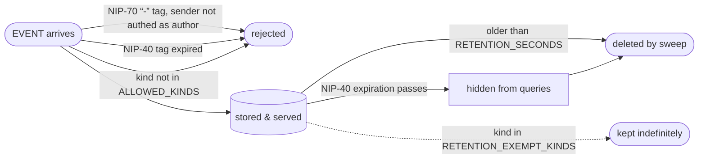

# Ephemeral Relay

**Events are not forever.**

[](LICENSE)
[](https://golang.org/dl/)
[](https://khatru.nostr.technology)
[](https://github.com/nostr-protocol/nips)

Ephemeral Relay is a Nostr relay for temporary events. Built for content whose natural lifetime is hours, not years — e.g. live-stream chat, bridged messages, presence — built on the [Khatru](https://khatru.nostr.technology) framework.

The relay tells clients its policy itself. Its NIP-11 description is generated from your acceptance and retention settings, so you don't have to trust a README:

`Accepts kinds 0,5,7,16,1311,1312,1313,9735,10312 only. All events except kinds 0 are deleted after 3h0m0s.`

## The life of an event



## Protected three ways

The posture of this relay is **ephemeral, limited, anti-gossip**. For content that must not outlive its moment — say, chat bridged from users on another platform who never signed up for permanent, globally-replicated speech. It is intended to be used together with events holding NIP-40 and NIP-70 tags.

1. **Blanket TTL** — the relay hard-deletes every retained-kind event after `RETENTION_SECONDS`.
2. **NIP-40 expiration** — the relay respects NIP-40 expiration times, and recommends it, so that even if a copy escapes to other relays, honest ones delete it on schedule.
3. **NIP-70 protected events** — the relay respects NIP-70 protected events, validates them with NIP-42 and recommends their use so that an honest relay will not accept the event from anyone but its author and a rebroadcast copy is never stored at all.

The ephemeral anti-gossip posture is that this relay will delete events after RETENTION_SECONDS, and that all other honest relays should not store the events at all (NIP-70), and should delete them at expiry if stored (NIP-40).

## Why this relay

No off-the-shelf relay combined these (as of mid-2026):

| | [nostr-rs-relay](https://github.com/scsibug/nostr-rs-relay) | [strfry](https://github.com/hoytech/strfry) | [WoT Relay](https://github.com/bitvora/wot-relay) (khatru) | **Ephemeral Relay** |
|---|:---:|:---:|:---:|:---:|
| Age-based retention | — | — | Days-grain | ✅ |
| Kind allowlist | ✅ | Plugin | — | ✅ |
| NIP-40 honoured | ✅ | ✅ | — | ✅ |
| NIP-70 enforced | — | ✅ | ✅ | ✅ |

## Prove it in 60 seconds

With docker and [nak](https://github.com/fiatjaf/nak):

```bash
docker compose up -d --build   # relay on ws://localhost:7448

# publish a chat message that expires in 30 seconds
nak event -k 1311 -c "I will expire" -t expiration=$(($(date +%s)+30)) ws://localhost:7448

nak req -k 1311 ws://localhost:7448   # there it is
sleep 30
nak req -k 1311 ws://localhost:7448   # gone
```

## Use Cases

- **Live stream chat**: chat messages, reactions, reposts and zap receipts live for the duration of a show and then scroll away, like chat is supposed to.
- **Bridged content**: colocate with a bridge that republishes users from another platform; stamp its events with `expiration` and `-` to enforce transience across an honest network.
- **Ephemeral notice boards**: announcements, presence, status — anywhere stale content is worse than no content.

The default kind set is live-chat flavoured, but **it's entirely yours to configure** — set `ALLOWED_KINDS` to whatever your use case needs. The only opinion this relay keeps is that things expire.

## Prerequisites

- **Go**: Ensure you have Go installed on your system. You can download it from [here](https://golang.org/dl/).
- **Build Essentials**: If you're using Linux, you may need to install build essentials. You can do this by running `sudo apt install build-essential`.

## Setup Instructions

### 1. Clone the repository

```bash
git clone https://github.com/r0d8lsh0p/ephemeral-relay.git
cd ephemeral-relay
```

### 2. Copy `.env.example` to `.env`

```bash
cp .env.example .env
```

### 3. Set your environment variables

| Variable | Default | Meaning |
|---|---|---|
| `ALLOWED_KINDS` | `0,5,7,16,1311,1312,1313,9735,10312` | Only these kinds are accepted — configure for your use case. Default covers profiles, deletions, reactions, reposts, live chat / raids / clips (1311/1312/1313, per [zap.stream](https://github.com/v0l/zap.stream)), zap receipts, and NIP-53 room presence |
| `RETENTION_SECONDS` | `10800` (3 h) | Events older than this are hard-deleted |
| `PURGE_INTERVAL_SECONDS` | `600` | How often the deletion sweep runs |
| `RETENTION_EXEMPT_KINDS` | `0` | Kinds kept indefinitely (profiles by default) |
| `RATE_LIMIT_EVENTS_PER_SEC` / `RATE_LIMIT_BURST` | `10` / `50` | Per-IP write rate limit |
| `TRUSTED_IPS` | — | IPs exempt from the rate limit |
| `PORT` | `3335` | Listen port |
| `DB_PATH` | `db/` | Badger database path |
| `RELAY_NAME` / `RELAY_PUBKEY` / `RELAY_ICON` / `RELAY_CONTACT` / `RELAY_DESCRIPTION` | — | NIP-11 identity (description auto-generated from retention settings unless set) |

Some values are fixed on purpose:

| Fixed | Value | Why it isn't an env var |
|---|---|---|
| Ephemeral-range wildcard | off | khatru's kind policy can blanket-admit all of NIP-01's ephemeral range (20000–29999); that would undercut the *limited* posture. Want a specific ephemeral kind? Put its number in `ALLOWED_KINDS`. |
| Timestamp sanity window | 2 h past / 30 min future | Events dated outside this window are rejected so that back-dating or forward-dating cannot be used to avoid deletion. |

> [!NOTE]
> The expected use of `TRUSTED_IPS` is colocating this relay with a **bridge**: a bridge funnels many streams' chat through a single egress IP and would otherwise be throttled like one anonymous client. On a platform like Railway, run relay and bridge in the same project and whitelist the bridge's private-network address.

> [!IMPORTANT]
> NIP-40 can only *shorten* an event's life. A distant expiration does not exempt an event from `RETENTION_SECONDS` — the blanket window always wins.

### 4. Build the project

```bash
go build
```

### 5. Create a Systemd Service (optional)

1. Create the file:

```bash
sudo nano /etc/systemd/system/ephemeral-relay.service
```

2. Add the following contents:

```ini
[Unit]
Description=Ephemeral Relay Service
After=network.target

[Service]
ExecStart=/home/ubuntu/ephemeral-relay/ephemeral-relay
WorkingDirectory=/home/ubuntu/ephemeral-relay
Restart=always

[Install]
WantedBy=multi-user.target
```

Replace `/home/ubuntu/` with the actual path where you cloned the repository.

3. Reload systemd, start, and (optionally) enable on boot:

```bash
sudo systemctl daemon-reload
sudo systemctl start ephemeral-relay
sudo systemctl enable ephemeral-relay
```

> [!TIP]
> If the relay can't read or write its database, give the service user ownership of the db folder — `sudo chown -R <service-user> /path/to/db` — rather than opening permissions wide.

### 6. Serving over nginx (optional)

```nginx
server {
    listen 80;
    server_name chat.yourdomain.com;

    location / {
        proxy_pass http://localhost:3335;
        proxy_set_header Host $host;
        proxy_set_header X-Real-IP $remote_addr;
        proxy_set_header X-Forwarded-For $proxy_add_x_forwarded_for;
        proxy_set_header X-Forwarded-Proto $scheme;
        proxy_http_version 1.1;
        proxy_set_header Upgrade $http_upgrade;
        proxy_set_header Connection "upgrade";
    }
}
```

Replace `chat.yourdomain.com` with your actual domain name, then restart nginx:

```bash
sudo systemctl restart nginx
```

> [!WARNING]
> `X-Forwarded-For` is load-bearing: the rate limiter identifies clients by real IP through the proxy, and `TRUSTED_IPS` entries are matched against those. Strip or mangle it and every client looks like your proxy.

### 7. Install Certbot (optional)

If you want to serve the relay over HTTPS, use Certbot to generate an SSL certificate:

```bash
sudo apt-get update
sudo apt-get install certbot python3-certbot-nginx
sudo certbot --nginx
```

### 8. Access the relay

Once everything is set up, the relay will be running on `localhost:3335` or your domain name if you set up nginx. Fetch its NIP-11 document to confirm the policy it's advertising:

```bash
curl -H 'Accept: application/nostr+json' https://chat.yourdomain.com
```

## Start the Project with Docker Compose

1. Ensure Docker and Docker Compose are installed on your system.
2. Adjust the environment variables in `docker-compose.yml` as needed.
3. Run:

   ```sh
   # in foreground
   docker compose up --build
   # in background
   docker compose up --build -d
   ```

4. To update the relay:

   ```sh
   git pull
   docker compose build --no-cache
   docker compose up -d
   ```

The `relay` service will be accessible on port 7448 (mapped from the container's 3335).

## End-to-End Tests

A protocol-level checker lives in `e2e/`. Point it at a relay running with short retention:

```bash
RETENTION_SECONDS=8 PURGE_INTERVAL_SECONDS=2 PORT=3336 DB_PATH=/tmp/eph-e2e ./ephemeral-relay &
go run ./e2e -relay ws://localhost:3336 -retention 8
```

Checks: disallowed kinds rejected; chat accepted and served; after the retention window chat is purged while a kind 0 profile survives.

Additional modes:

```bash
go run ./e2e -relay ws://localhost:3336 -nip40 -ttl 180 # short-TTL event dies on time, tagless control survives
go run ./e2e -relay ws://localhost:3336 -nip70 # "-" events: author-only publish, rebroadcasts refused
go run ./e2e -relay ws://localhost:3336 -burst-only # rate limiter caps an untrusted burst
go run ./e2e -relay ws://localhost:3336 -burst-only -burst-trusted # TRUSTED_IPS bypass takes the full volley
```

## License

MIT
